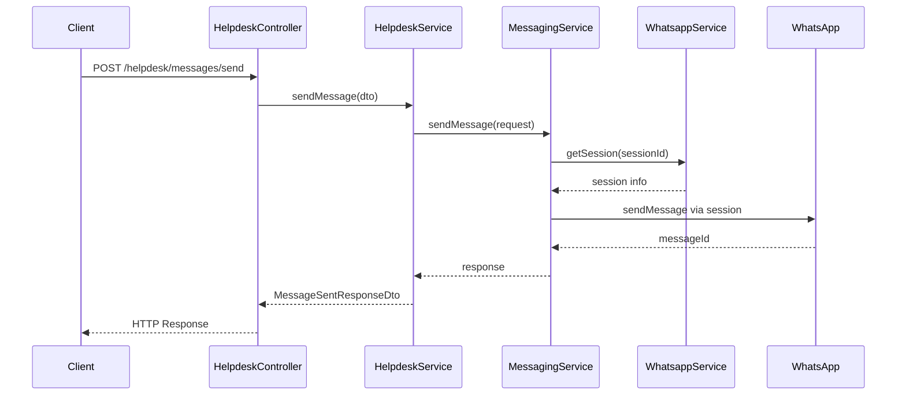
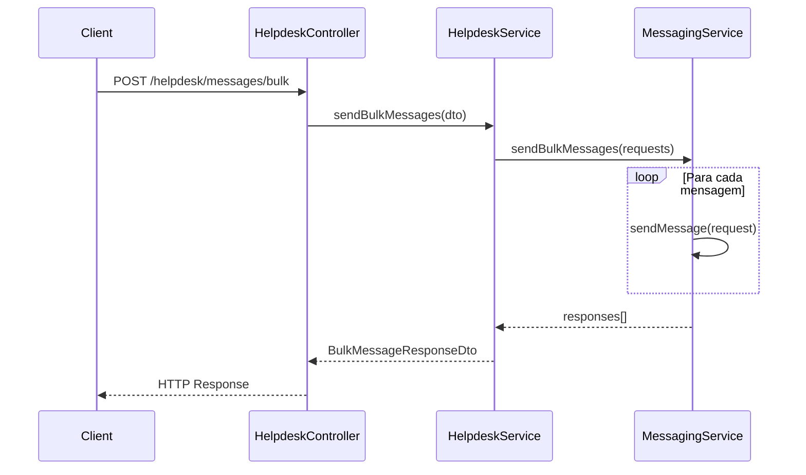

# Arquitetura de Mensageria - API CDS Bot

## Visão Geral

A arquitetura de mensageria foi reorganizada para separar claramente as responsabilidades entre os módulos:

- **WhatsApp Module**: Gerenciamento de conexões e sessões
- **Helpdesk Module**: Envio de mensagens e atendimento ao cliente
- **Marketing Module**: Campanhas e mensagens em massa (futuro)
- **Shared Module**: Serviços compartilhados de mensageria

## Módulos e Responsabilidades

### 1. WhatsApp Module (`/src/whatsapp/`)

**Responsabilidades:**
- Criação e gerenciamento de sessões WhatsApp
- Autenticação via QR Code
- Monitoramento de status de conexão
- WebSocket para eventos em tempo real

**Endpoints:**
```
POST   /whatsapp/session          # Criar nova sessão
GET    /whatsapp/sessions         # Listar sessões
GET    /whatsapp/session/:id      # Obter informações da sessão
DELETE /whatsapp/session/:id      # Encerrar sessão
GET    /whatsapp/events/stream    # Stream de eventos (SSE)
```

**WebSocket Events:**
```
join-session    # Entrar em uma sessão
leave-session   # Sair de uma sessão
get-sessions    # Obter lista de sessões
```

### 2. Helpdesk Module (`/src/helpdesk/`)

**Responsabilidades:**
- Envio de mensagens individuais
- Envio de mensagens em lote
- Gerenciamento de conversas
- Atendimento ao cliente

**Endpoints de Mensageria:**
```
POST /helpdesk/messages/send        # Enviar mensagem individual
POST /helpdesk/messages/bulk        # Enviar mensagens em lote
GET  /helpdesk/sessions/available   # Listar sessões disponíveis
```

**Endpoints de Conversas:**
```
POST /helpdesk/conversation/start                    # Iniciar conversa
POST /helpdesk/conversation/:id/response             # Enviar resposta
GET  /helpdesk/conversations                         # Listar conversas ativas
GET  /helpdesk/conversation/:id/history              # Histórico da conversa
POST /helpdesk/conversation/:id/close                # Encerrar conversa
```

### 3. Shared Module (`/src/shared/`)

**Responsabilidades:**
- MessagingService: Centraliza lógica de envio
- DTOs compartilhados
- Interfaces comuns
- Validações centralizadas

## Fluxo de Envio de Mensagens

### 1. Envio Individual



### 2. Envio em Lote



## DTOs e Interfaces

### SendMessageDto (Helpdesk)

```typescript
export class SendMessageDto {
  sessionId: string;        // ID da sessão WhatsApp
  to: string;              // Número no formato internacional
  message: string;         // Conteúdo da mensagem
  type?: MessageType;      // Tipo: text, image, document
  agentId?: string;        // ID do agente (opcional)
  conversationId?: string; // ID da conversa (opcional)
}
```

### MessageSentResponseDto

```typescript
export class MessageSentResponseDto {
  success: boolean;
  message: string;
  data?: {
    messageId: string;
    timestamp: Date;
    conversationId?: string;
  };
  error?: string;
}
```

### BulkMessageDto

```typescript
export class BulkMessageDto {
  messages: SendMessageDto[];
}
```

## Validações

### Número de Telefone
- Formato: `^[1-9][0-9]{7,14}$`
- Exemplo: `5511999887766`
- Sem símbolos (+, -, espaços)

### Session ID
- Formato: `^[a-zA-Z0-9-_]+$`
- Exemplo: `helpdesk-session-01`

### Mensagem
- Máximo: 4096 caracteres
- Mínimo: 1 caracter
- Não pode ser vazia

## Tratamento de Erros

### Códigos de Status HTTP

| Status | Descrição | Cenário |
|--------|-----------|---------|
| 200 | Sucesso | Mensagem enviada com sucesso |
| 400 | Bad Request | Dados inválidos (validação) |
| 404 | Not Found | Sessão não encontrada |
| 500 | Internal Server Error | Erro interno do servidor |

### Estrutura de Erro

```typescript
{
  "success": false,
  "message": "Descrição do erro",
  "error": "Detalhes técnicos do erro"
}
```

## Exemplos de Uso

### 1. Enviar Mensagem Individual

```bash
curl -X POST http://localhost:3000/helpdesk/messages/send \
  -H "Content-Type: application/json" \
  -d '{
    "sessionId": "helpdesk-session-01",
    "to": "5511999887766",
    "message": "Olá! Como posso ajudá-lo hoje?",
    "agentId": "agent-123"
  }'
```

**Resposta:**
```json
{
  "success": true,
  "message": "Mensagem enviada com sucesso",
  "data": {
    "messageId": "msg_1234567890_abc123",
    "timestamp": "2024-01-15T10:30:00.000Z"
  }
}
```

### 2. Enviar Mensagens em Lote

```bash
curl -X POST http://localhost:3000/helpdesk/messages/bulk \
  -H "Content-Type: application/json" \
  -d '{
    "messages": [
      {
        "sessionId": "helpdesk-session-01",
        "to": "5511999887766",
        "message": "Primeira mensagem"
      },
      {
        "sessionId": "helpdesk-session-01",
        "to": "5511888776655",
        "message": "Segunda mensagem"
      }
    ]
  }'
```

### 3. Listar Sessões Disponíveis

```bash
curl -X GET http://localhost:3000/helpdesk/sessions/available
```

**Resposta:**
```json
{
  "success": true,
  "message": "Sessões disponíveis recuperadas com sucesso",
  "data": [
    {
      "sessionId": "helpdesk-session-01",
      "status": "connected",
      "phone": "5511999887766",
      "name": "Helpdesk Principal"
    }
  ]
}
```

## Migração da API Antiga

### Endpoints Removidos

| Endpoint Antigo | Novo Endpoint | Módulo |
|----------------|---------------|---------|
| `POST /whatsapp/send` | `POST /helpdesk/messages/send` | Helpdesk |

### Mudanças nos DTOs

- `SendMessageDto` movido de `/whatsapp/dto/` para `/helpdesk/dto/messaging.dto.ts`
- Adicionados campos opcionais: `agentId`, `conversationId`, `type`
- Estrutura de resposta padronizada

## Benefícios da Nova Arquitetura

1. **Separação de Responsabilidades**: Cada módulo tem uma função específica
2. **Escalabilidade**: Facilita adição de novos canais de comunicação
3. **Manutenibilidade**: Código mais organizado e fácil de manter
4. **Reutilização**: MessagingService pode ser usado por outros módulos
5. **Testabilidade**: Componentes isolados são mais fáceis de testar

## Próximos Passos

1. Implementar módulo Marketing para campanhas
2. Adicionar suporte a outros tipos de mídia
3. Implementar sistema de templates de mensagem
4. Adicionar métricas e analytics de envio
5. Implementar rate limiting para envios em massa